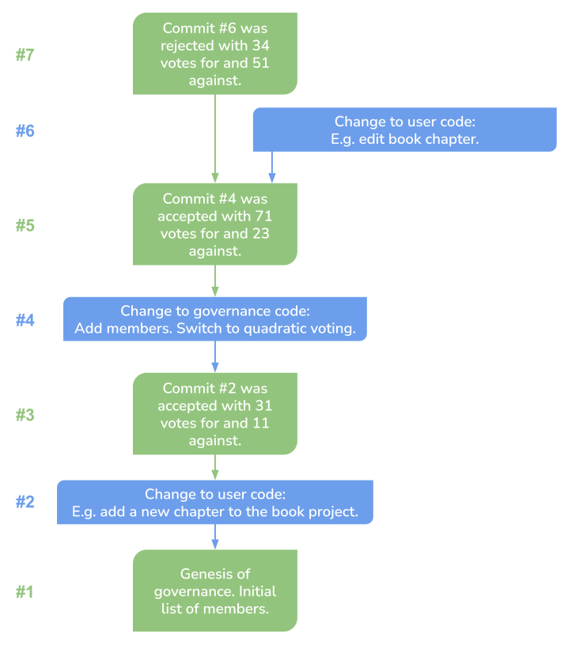

# Governance for git

## Synopsis

There is an increasing interest in applications that incorporate governance. At the same time there is no standardized computational and security model for thinking of governance formally or building applications according to a standard workflow.

We take advantage of the observation that governance can be viewed as a protocol that enables a group of parties to conduct themselves according to rules of governance that they elect collaboratively, all the while providing mechanisms for transparency and accountability.

This leads us to propose a generic framework for building governance applications based on git. Our framework automates the common obligations of governance (particularly, security and accountability) leaving developers and users to focus on application logic.

We embody this framework into a simple command-line tool, which enables rapid development and deployment of governance apps. In particular, our approach provides a way of augmenting a git repo with a self-certifying governance mechanism, which can be used to arbitrate changes to the repo, according to user-defined governing rules, in a transparent and verifiable manner.

This tool unlocks a vast array of applications. Most prominently it makes it possible to convert any git-based open-source project into a collaborative community with configurable governance rules.

### Problem and objective

In general governance is a protocol shared between the members of a group to make decisions — on some subject or on governance itself — over time.
Of interest to us are all applications of governance which are transparent and accountable to all participants, but with no restriction on the particular logic of governance (e.g. how arbitration is handled, be it using chain-of-command, quadratic voting, one-person-one-vote and so on.)

Our goal is to devise a highly reusable and composable embodiment of governance in a software framework, which guarantees transparency, accountability (i.e. verifiability) and non-malleability of governance records out-of-the-box, and independently of the particular logic of any one application.

Furthermore, in order for such a framework to be impactful in practice it must meet a few additional criteria.
- It must have low deployment and integration complexity.
- It must operate in a trust model where the members of governance are mutually distrusting parties.
- The correctness of governance operations should not depend on trusted third parties.
- Governance must be able to interoperate with blockchain smart contracts. In particular, governance motions should be able to depend on or influence blockchain-hosted variables.

To address this goal I reframe governance as a digital protocol shared amongst the contributors to a git repo, whose purpose is to arbitrate the decisions governing which code commits can be merged into a distinguished `main` branch, representing the current state of the world.

This reformulation of the goal of governance is particularly general and widely applicable, because the recorded history of most collaborative enterprises (the users of governance) can at least in principle be captured in the git semantic. No mention is required, of course, that every existing collaborative open-source project is already captured in this format.

### Solution outline

Our approach is to think of governance as a programmable state machine, which can interact with its group members (e.g. when voting) and alter its state to reflect governance proceedings and decisions in a verifiable and self-certifying manner.

The key idea is to embed a representation of the governance state machine (and its programmable logic) into the user's git repository, in a dedicated `.gov` directory alongside the user's code.

In this setting, every individual commit in the repository captures both the relevant state of governance, and the state of the user's application code. 
Furthermore, the git history of a commit (since the genesis commit) constitutes a cryptographically verifiable proof that this commit was reached through a sequence of governance decisions made according to the relevant logic of governance. E.g. it could represent a proof that every code change was approved by a quadratic vote of the group members.

In this sense the git representation of governance is _self-certifying_. This property ensures that governance is transparent and accountable. Anyone in possession of a copy of the repo can single-handedly verify that all rules of governance and arbitration have been followed to reach the latest state.

This framework espouses a natural mental model, which is familiar to developers from other domains such as CI/CD integration with git. In our case, an individual commit represents either a change in code, or a change in governance state (as a result of a governance operation, like a referendum). The latter are encoded in a human-readable format, which follows a protocol that enables post factum cryptographic verification.

Another central consideration in our design is to decouple the specific rules (or logic) of governance applications from the common responsibilities of all governance applications (transparency and accountability). To this end, we architect our framework to be _programmable_ in the sense that user-defined governance logic can be codified in the form of deterministic functions, which we name (governance) rules.

Rules codify application-specific governance logic. For instance, a rule may implement quadratic voting or one-person-one-vote procedures for arbitration. Rules mutate the governance state deterministically, based solely on the contents of the git repo as input, and triggered by commit events.

Rules are loosely analogous to smart contracts. Both record their state history in a verifiable manner using a merkle tree. Rules persist their history in a git repo; smart contracts persist theirs on chain. Rules are triggered by git commit events; smart contracts are triggered by network calls.

The following diagram of a git commit tree illustrates a verifiable governance history.



Blue boxes represent regular code changes. Green boxes represent governance operations that mutate the governance state. Green commits follow a prescribed format, which ensures the changes respect the governance rules established in the parent commit and that this is verifiable. For instance, commits #3, #5 and #7 represent arbitration by voting. They would incorporate signatures from all voters, which bind their votes to the commit being arbitrated, as well as to the commit that dictates the current rules of governance.

### Applications and integrations

At its core our design is purely a protocol that dictates how to record governance proceedings (like referendums, changes of governance rules, changes in membership, and so on) in the git substrate, so that the validity of governance history can be verified from those records alone. From a user standpoint, this ensures that history is correct (conforming to rules) and immutable.

A typical user will not interact with the governance protocol directly. At the lowest level of integration, users can use a command-line tool and access to a git repo to perform all roles and functions of governance (membership administration, voting, proposing, policymaking, and so on). This mode enables rapid code-free deployment of governance. It is appropriate for applications where participants have access to a community repo (such as one hosted on GitHub e.g.) and understanding of git.

The quintessential application of this type is collaborative contribution to a public open-source repo. 

For this application, a baseline collection of governance rules (e.g. quadratic-voting, one-person-one-vote, chain-of-command, etc.) 
combined with a per-directory configurability of governance provides a very flexible, batteries-included framework for governing collaborative code projects. This is a good target set of capabilities for an MVP.

Governance can also easily be integrated with workflows like GitHub pull requests via GitHub actions that utilize the command-line governance client.

Applications that utilize frontend interfaces can interact with governance using client libraries for a programming language (like TypeScript).

### Command-line user interface

_Step 1._ Create a genesis governance commit in your repo.
```sh
$ gov init
$ git commit -m "establishing governance from this commit onwards"
[main 0f7a6a1] ok
```

_Step 2._ Make changes to the user's source code

Create a new dev branch for making changes to code:
```sh
$ git checkout -b dev
Switched to a new branch 'dev'
```

Make some changes and save them:
```sh
$ git commit -m "proposed changes"
[dev 91e4be87] ok
```

_Step 3._ Conduct a referendum for approving a commit

Initiate a referendum for approval of the proposed changes:
```sh
$ gov propose
$ git commit -m "voting on commit 91e4be87 begins"
[dev 85ba1d03] ok
```

Members can now cast votes to the repo, using

```sh
$ gov vote yes --on-referendum 85ba1d03 
```

After all votes are submitted (see below), close the referendum and tally the results:

```sh
$ gov tally
Referendum on 91e4be87 was approved with 71 votes out of 122.
$ git commit -m "voting on commit 91e4be87 ended with approval"
[dev 33e1b78d] ok
```

_Step 4._ Merge the approved changes

The tallying commit from the previous step certifies all commits below it. Therefore, we can merge into the main branch.

```sh
$ git checkout main
$ git merge dev
```

_Verification._ Verify the validity of a commit

The governance protocol allows us to verify whether any given commit has been reached by respecting the rules of governance, since the genesis commit. Verification is provided by the command line tool:

```sh
$ gov verify
HEAD commit 33e1b78d has been reached correctly according to governance policies.
```
