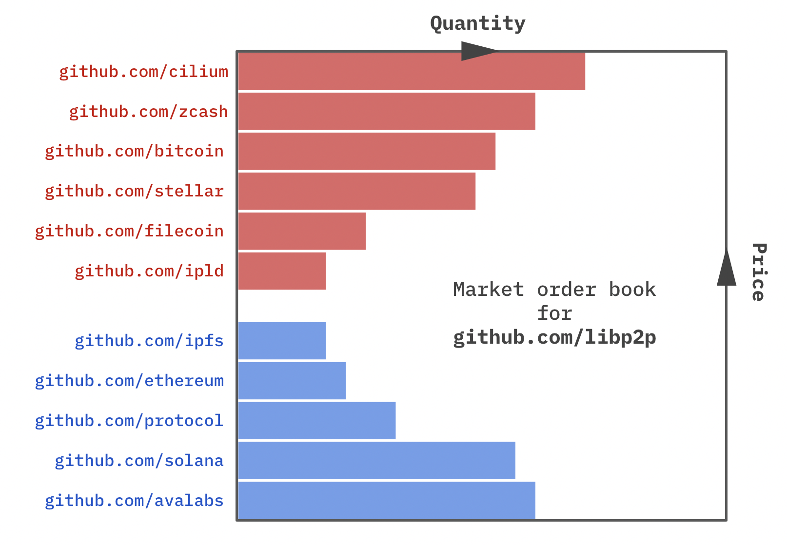

# Plural markets and the creative uncertainty of open source

_A high-level summary of this article was presented in a talk ([video](https://www.youtube.com/watch?v=Pmg9za7mu7I) and [slides](https://github.com/petar/maymounkov.org/blob/main/talks/ftc2022/Plural%20Markets%20and%20the%20Creative%20Uncertainty%20of%20Open%20Source.pdf)) at Funding The Commons 2022._

Open source development is both the ideological heart and the day-to-day engine of Web3. Increasingly open source projects are maturing from a place to write code together into sophisticated "community businesses". For instance, organizations like Ethereum and Protocol Labs are continuously innovating creative ways to use open source platforms like GitHub to maintain transparent business operations and communicate with their audiences. Multiple aspects of a community business — code development, organizational matters, planning, prioritization, specifications, documentation, public relations, discussions, support — are finding a natural home in the git framework, augmented with a few generic operational workflows like pull requests (PR), reviews, discussions and ticketing.

In essence, open source projects are growing into community businesses whose operations live on platforms like GitHub. They form an ecosystem of interdependent businesses, dynamically changing over time.

Successful open source projects have long and complex lives, which share an underappreciated similarity with private companies: They build and steward products in environments of perpetual uncertainty and surprise.

The private sector has found ways to offset the effects of this issue using financial markets, which provide corporations with an asynchronous, always-available mechanism for financing and hedging the risk of their day-to-day operations. It is striking that no such streamlined tools exist for open source.

In this article, I take a shot at this gap by imagining a permissionless community market for asynchronous financing of open source projects, based on a novel "plural equity" token contract. My emphasis here is on reaching a concrete, wholistic design (albeit necessarily bare-bones) that not only offers a reasonable solution to operational financing, but is also:

- (a) Intrinsically resilient to Sybil behavior and collusion
- (b) Pluralistic, in the sense that monopolistic states are not sustainable equilibria

To the best of my knowledge, there are no existing examples of permissionless applications that meet both criteria. For context, Bitcoin meets (a), using the pioneering concept of proof-of-work, but not (b). Whereas the quadratic funding mechanism of GitCoin meets (b), but not (a).

The burden of (a) is often viewed as an accidental nuisance in application design, and resolution is typically deferred to ad-hoc extrinsic solutions like reputation systems, proofs of personhood or ML-based approaches.

I take the contrary view that Sybil behavior should be accounted for intrinsically by the permissionless mechanism itself. In other words, collusion should be viewed as valid “allowed” behavior which works out to be unprofitable with respect to the mechanism's internal economics. I hope that the present design demonstrates this paradigm.

Accounting for Sybil behavior at the mechanism level addresses a couple of practical problems with extrinsic Sybil protections:
- First, not all communities are made of people or otherwise verifiable or definable entities. Large communities (like open source) are heterogeneous. Their members may be people, organizations and even other communities
- Second, ad hoc Sybil protections are hard, expensive and biased ([as witnessed by GitCoin](https://gitcoin.co/blog/a-community-based-roadmap-for-sybil-detection-across-web-3/#:~:text=The%20Need%20for%20Sybil%2DResistance%20in%20Gitcoin%20Grants&text=An%20individual%20whose%20voice%20should,donates%20to%20the%20same%20project.), for instance)

Finally, before we begin I would like to make a distinction between the problem of operational financing, addressed here, and prior works like grant financing. Operational needs are:

- _Endogenous:_ They are driven by the internal circumstances of an open source project (e.g. an unexpected opportunity to hire a new developer) in need of funding
- _Asynchronous:_ They arise at unplanned points in time
- _Fine-grain:_ They can pertain to sub-product technical details
  
In contrast, grant financing addresses needs that are:

- _Exogenous:_ They are driven by the external needs of the funder, usually a larger community
- _Synchronous:_ Grants are administered on a synchronized schedule (e.g. quarterly every year)
- _Coarse-grain:_ Grants tend to focus on product-level projects that can be described comprehensively but also concisely

In these respects, the present design addresses problems that are orthogonal to grant-based quadratic funding.

## Overview of open source equities

Public companies manage their financing needs by selling (or buying back) ownership in their venture by trading equity contracts. Ownership entitles contract holders (aka shareholders) to a proportional share of profits and a proportional share in votes, in perpetuity and at no marginal cost.

Here I develop _plural equity tokens_, an analog to conventional equities aimed at financing open source projects. By design objective, equity tokens are fungible and freely tradable (by members of the open source community) in order to afford the same level of frictionless financing accomplished by company equity.

In contrast to company equity, open source equity rewards the investor with _quadratic influence_ (QI) over the project, integrated into the pull request (PR) mechanism for approving and merging source changes, and implemented via a novel take on quadratic voting (QV). QI could be viewed as an asynchronous version of QV which also incorporates Sybil protections. While standard QV addresses synchronous elections and referendums, QI reimagines the mechanism in the asynchronous setting which not only models source code changes, but more broadly captures practical social processes like policymaking, whose nature is inextricably asynchronous.

In a departure from the design of company equity — which has no marginal cost — ownership of open source tokens (and the associated privilege of quadratic influence) incurs a [Harberger Tax](https://dzone.com/articles/harberger-taxes-on-ethereum#:~:text=Harberger%20Taxes%20is%20an%20economic,to%20anyone%20at%20that%20price.), which plays a few roles in our wholistic community market for equity tokens.

Its immediate consequence is to incentivize participants to buy (and hold) equity tokens at prices that truthfully reflect their marginal value from having involvement in the underlying open source project. Since open source projects hold some of their own tokens, they are also subject to tax. This incentivizes them to make expedient use of the capital they have raised through token sales, or else lose it to taxes with the passing of time.

More curiously, we utilize the Harberger Tax to resolve the well-known weakness of quadratic mechanisms to Sybil attacks. In our case, Quadratic Influence is based on the principles of Quadratic Voting, and without taking special care it would be vulnerable to such attacks, which I believe is a major impedance to success for any permissionless mechanism design.

We observe that the taxes paid by an individual market participant are a natural measure of their life-time contributions to the community. We then show that if the quadratic power rule — which states that voting power is the square root of voting credits — is discounted by the square root of a member's community contributions, Sybil behavior becomes provably irrational.

This generalization of quadratic power disarms the Sybil attack by emphasizing the voting power of senior community members — those that have contributed more over time. Yet — in another application of plural ideas — the square root scaling of seniority prevents earlier members from usurping majority power.

More generally, we point out that in the permissionless setting Sybil attacks are not a "weakness" per se, but rather an expression of the mathematical unsoundness of treating all members (of which there can be infinitely many) as unquantifiably equal for purposes of voting.

## Design

This section describes our design comprehensively, aiming for a practical but rigorous level of detail.

### Community market

The backdrop is a permissionless community whose members are public open-source projects (e.g. as embodied by public GitHub organizations), each associated with a public URL.

A community market — implemented by a smart contract — provides community members with the ability to issue, trade and burn equity tokens, and supports them in exercising the privileges and meeting the obligations associated with token ownership.

Every community member is entitled to issue (and burn) an unlimited number of fungible equity tokens, associated with and initially owned by the issuing member themselves. Issuance is governed by the trusted market contract to protect investors from dilution by enforcing three conditions:
- All issued equity is public
- Any anticipated schedule of future issuance is public
- Any unanticipated changes to issuance must be approved by a shareholder vote, using the mechanism of Quadratic Influence (explained later)

Assuming an exogenous currency, for instance USD, the community market provides an exchange — in the style of a limit-order market book — to its members for trading USD against equity tokens.

Thus far, the equity tokens and the associated exchange-based market are very much analogous to public company equities and equity exchanges (like NYSE).

### Harberger Tax

Ownership of equity tokens is burdened by a Harberger Tax — the marginal cost of equity token ownership.

Following the original Harberger construction (but applying it to equity tokens instead of land), market participants are required to:
- Publicly declare a self-assessed value (in USD) for all equity tokens they hold
- Pay a periodic tax (in USD) on the total self-assessed value of equity holdings. (The size and frequency of this tax are parameters of market governance.)
- Sell any equity token whenever a counterparty is willing to pay the self-assessed token price

In exchange-based parlance, the first and the third condition amount to requiring each participant to maintain a sell-side (ask) limit order for every equity token they hold, at all times.

The community market is responsible for determining the market-wide tax rate $\theta$ (via a governance process described later), collecting taxes and keeping a public record of members' tax history, which is used by the influence mechanism described next.

### Influence

Ownership of equity tokens rewards the privilege of limited influence over the operations of the underlying open source project.
Influence is the benefit enjoyed for making an investment.

A typical, transparently run, community open-source project conducts a large part of its business on a git repo: development, planning, prioritization, governance, communications, to name a few. Therefore, all related decisions pass through the bottleneck of the pull request (PR) approval process, making it an ideal place to apply a shareholder influence mechanism.

A pull request, we stipulate, is a proposal of change, which is in a state of review until a sufficiently strong vote of approval is reached _asynchronously_. In practice, participants optionally cast a vote on each individual commit within a PR. The PR is "approved" only if the latest commit has enough votes. Whereby every shareholder $i$ in an open-source project $x$ is entitled to a vote "for" or "against" any proposal with a voting power of $v_{i,x}$. 

A pull request is accepted (and merged) when and if the votes "for" minus the votes "against" exceed a threshold $\tau_x$, where $\tau_x$ is a parameter. Formally,

$$\sum_{\text{$i$ votes "for"}} v_{i,x} - 
     \sum_{\text{$j$ votes "against"}} v_{j,x} \ge \tau_x$$

The threshold $\tau_x \ge 0$ is determined by the governance of each individual open source organization $x$. It controls the level of shareholder support required to approve a change (PR) as well as the relative veto power of shareholders.

We would like the voting power $v_{i,x}$ of a shareholder $i$ to be proportional to the number of equity tokens they own $s_{i,x}$ in a [pluralistic](https://inciteful.xyz/p/179529716) manner, in order to benefit from the desirable properties of quadratic voting.

The original quadratic voting pricing rule, which in our case stipulates $v_{i,x}=\sqrt{s_{i,x}}$, is not appropriate for a permissionless market. QV was designed for the permissioned setting, and in a permissionless system it is vulnerable to a Sybil attack (as we demonstrate later).

Prior works (like GitCoin Grants) have relied on extrinsic (to the economic mechanism) means of addressing Sybil behavior, e.g. by suppressing it using biased and expensive ML approaches which may attempt to distinguish humans from bots.

Instead, I attempt to address this issue in a manner entirely intrinsic to the market's economic mechanism. This makes the solution easier to implement, less biased and applicable to a larger range of applications, where community members need not be human (e.g. communities of communities or communities of large organizations).

The key idea is to associate every member of a permissionless community with a meaningul economic measure of their past contributions to the community, which I call member _seniority_.
Subsequently, the seniority of $i$ is used as a factor in determining the voting power $v_{i,x}$ of $i$.

In our setting, the total amount of Harberger Tax (in dollars) $h_i$  that member $i$ has paid to the community since joining is an appropriate measure of member contributions. It directly reflects capital disbursed to the community and it requires substantial amount of time to accummulate.

I consider the entire class of voting power functions

$$v_{i,x} = s_{i,x}^\alpha \cdot h_i^\beta$$

for all exponents $\alpha$ and $\beta$. Intuitively, the first factor $s_{i,x}^\alpha$ rewards ownership (i.e. investment) in an open source project; while the second factor $h_i^\beta$ rewards contributions to the open source community as a whole.

In the analysis that follows, I investigate the incentives for Sybil behavior assuming a fixed dollar budget. I prove that:
- If $\alpha+\beta<1$, Sybil behavior is profitable.
- If $\alpha+\beta=1$, Sybil behavior has no effect.
- If $\alpha+\beta>1$, Sybil behavior incurs a loss.

This finding informs the setting $\alpha=\frac{1}{2}$ and $\beta=\frac{1}{2}$ as the unique one for which:
- Voting power is pluralistic both with respect to equity ownership $s_{i,x}$ and with respect to community contributions $h_i$, and
- Sybil behavior is not profitable under a fixed dollar budget.

Thus, we adopt the voting power function

$$v_{i,x}=\sqrt{s_{i,x}\cdot h_i}$$

## Governance

There are two uses of governance in our open-source community design. On the one hand, each open source organization $x$ has its own autonomous governance, which dictates organization-specific parameters like the voting threshold $\tau_x$ as well as other organization-related policies. On the other hand, the community market has its own governance, which determines market-wide parameters like the tax rate $\theta$. In both cases, a mechanism for stakeholders to make changes to policies under agreement is necessary.

I try to address this problem of governance at a level of generality that applies broadly. 

Here we are interested in the operational aspect of governance, as a workflow that enables a group of stakeholders to make changes to a code of governance (i.e. a text document), breaking ties of disagreement using a mechanism (which itself may be described in the code of governance). From this perspective it is no stretch of the imagination to see governance as analogous to collaborative contributions to an open source project, supported by an arbitration mechanism.

Much like a repository of code, a code of governance needs to maintain an immutable history of changes for accountability and a distinguished version (the HEAD commit) that dictates the currently governing code. In practice, arbitration mechanisms for governance roughly fall in two categories: synchronous and asynchronous. Elections and referendums, for instance, involve a synchronized vote over a set of alternatives. Whereas policymaking is asynchronous in that policy proposals arise asynchronously; policy discussions and modifications are conducted asynchronously; and policies are adopted asynchronously when a consensus over the latest iteration is reached.

Our focus is on asynchronous governance, since this is the common case when it comes to day-to-day operational needs. 
It is evident that the quadratic influence mechanism for approving pull requests (PRs) fits the description of an asynchronous governance mechanism. Thus it is compelling to reuse quadratic influence for all needs of governance in our design. After all, if a mechanism is good enough for arbitrating changes in code, it should be good enough for arbitrating changes in code of governance.

In the context of our application, this means that the governance of the community market is embodied in an open source project dedicated to the development of the smart contract implementation, and equipped with the aforementioned quadratic influence mechanism. Since the market represents the entire community, its stakeholders and their voting power need to be addressed differently. The stakeholders in the market are all community members (i.e. open source organizations). What should their stakes be?

Earlier, we proportioned stake in an open source project in relation to the number of equity tokens held. What is the analog of that for stake in the community of all open source projects, as a whole?

One natural metric of stake is the total amount of investment $S_x$ that a member $x$ currently has in the community. This quantity is directly captured as the total dollar-denominated value of equity tokens that member $x$ holds. With this choice of stake, the voting power $V_x$ of each member $x$ under quadratic influence is:

$$V_x = \sqrt{S_x\cdot h_x}$$

By reusing quadratic influence for governance we ensure that governance is protected by the same mechanisms of plurality and Sybil resistance, enjoyed by member open source organizations. Having addressed governance we have now completed a wholistic design of a community market, which is plural and intrinsically robust to Sybil behavior without making assumptions on the nature of its "non-permissioned" members.

## Rationale and analysis

This section discusses some business and incentive implications of our market design and provides a detailed proof of our Sybil argument.

### Ownership and effects of taxation

The value of an equity token is captured in the team behind the underlying open source project, as well as the public git URL of the project. The team develops the project, whereas the URL captures the audience of dependent projects. Both are assets of the organization.

To the investor (buyer) in an equity token, the benefit of ownership comes in the form of voting rights, administered using the quadratic influence rule described earlier. Each investor will derive a marginal value $u$ (denominated in USD) from this benefit, which is unique to them and variable over time.

At the same time, the investor incurs a marginal cost in paying the Harberger Tax on ownership, which equals $\theta \cdot p$, where $\theta$ is the tax rate and $p$ is the price at which the investor is willing to sell their equity.

Therefore, assuming investors balance their marginal value and cost, $u=\theta\cdot p$, we could interpret equity token prices as reflective of the average marginal value (across shareholders) of the open source project, divided by the tax rate, i.e. $p=u/\theta$.

### Strategies of influence

Open source organizations can use quadratic influence strategically to accomplish different styles of operation. Each organization $x$ controls two key parameters of quadratic influence over their own PR approval process:
- the value of the quadratic influence threshold $\tau_x$, which is determined by the organization's governance via a stakeholder vote, and
- the amount of the organization's own equity tokens that it retains, which determines the organization's voting power $v_{x,x}$ relative to outside stakeholders $\sum_{y\neq x} v_{y,x}$

These are dynamic parameters that can change over time. In any one instant, however, their relative relationship establishes the balance of power and has implications for PR approvals.

- If $v_{x,x}-\sum_{y\neq x}v_{y,x} > \tau_x$, the organization has a unilateral majority power over the PR approval process that can not be vetoed by outside shareholders
- If $v_{x,x} > \tau_x$, the organization can approve PRs on its own, unless outside shareholders veto by casting an opposing vote
- If $v_{x,x} < \tau_x$, every PR approval requires the attention of multiple shareholders

The first may suit startup projects that prefer to have full steering control over their early product.  The second works well for mature projects deployed in-production with multiple users who are also shareholders. The third fits the needs of community governance projects, like a DAO or an official smart-contract implementation, where there are large numbers of community shareholders with a long tail of equity share.

### Market structure and volatility

The use of a Harberger Tax in conjunction with tradable equity contracts has an unexpected positive impact on market book dynamics. As pointed out earlier, the Harberger Tax obligates all participants to maintain open limit sell orders for all equity tokens they own, at all times. This condition implies that the entire circulating supply of equity tokens (for every open-source project) is always available on the sell side of the limit order market book. In other words, this amounts to a market which is fully liquid by design. As a result, market making — which is generally a source of volatility — is not necessary.

In another departure from the design of traditional company equity markets, the market book for equity tokens must make the identities of the members behind sell side limit orders public. This is a consequence of the facts that (a) shareholder voting power must be public and (b) shareholder voting power depends on the self-assessed value of equity tokens (which is expressed by the price in a sell side limit order). This provides transparency to the community as to who sponsors and influences any given open source project.

I leave it as an open question whether the identities of buy side limit orders should be kept anonymous or not.

### Disarming Sybil behavior

Let us first recall why the standard QV rule, $v_{i,x}=\sqrt{s_{i,x}}$, is vulnerable to Sybil attacks. If an attacker with a fixed dollar budget $D$ distributes their capital uniformly across $n$ Sybils, they aggregate a total voting power of

$$\sum_{i=1}^n\sqrt{s_{i,x}}
     =\sum_{i=1}^n\sqrt{\frac{D}{n}}
     =n\sqrt{\frac{D}{n}}=\sqrt{nD}$$

This quantity scales with the number of Sybils, $n$, thus making Sybil behavior profitable even under a fixed dollar budget.

In contrast, let us consider the voting rule
$$v_{i,x}=s_{i,x}^\alpha \cdot h_i^\beta$$
An attacker can distribute their budget $D$ across the equity ownership $s_{i,x}$ (for all $i$) and the community contributions $h_i$ (for all $i$) of the Sybils $i$ that they control, as long as the constraint on the budget $b$ is respected:
$$b=\sum_i ps_{i,x}+\sum_i h_i \le D$$
where $p$ is the average dollar price of the equity token in question.

In doing so, the attacker seeks to maximize the total voting power of all Sybils:
$$v = \sum_i s_{i,x}^\alpha \cdot h_i^\beta$$
This is an optimization problem which can be solved using the method of [Lagrange multipliers](https://en.wikipedia.org/wiki/Lagrange_multiplier), whereby maximum voting power is attained when the partial derivatives of the Lagrangian $L=v-\lambda b$ vanish:
$$\frac{\partial L}{\partial s_{i,x}}=\alpha s_{i,x}^{\alpha-1}h_i^\beta - \lambda p = 0$$
$$\frac{\partial L}{\partial h_i}=\beta s_{i,x}^\alpha h_i^{\beta-1} - \lambda = 0$$
$$\frac{\partial L}{\partial \lambda}= \sum_i ps_{i,x}+\sum_i h_i - D = 0$$

The first two equations imply $h_i=p\frac{\alpha}{\beta}\cdot s_{i,x}$.

Using this, we can derive a simpler expression for the voting power of the Sybils:

$$v=\sum_i s_{i,x}^\alpha h_i^\beta 
     = \left( p\frac{\alpha}{\beta}\right)\sum_i s_{i,x}^{\alpha+\beta}
     = O(1)\sum_i s_{i,x}^{\alpha+\beta}$$

Using the third Lagrangian equation we can also derive the constraint:
$$S = \sum_i s_{i,x}=\frac{D}{\left(1+\frac{\beta}{\alpha}\right)p}=O(1)$$
The $O(1)$ notation absorbs any quantities that are independent of Sybil behavior (i.e. independent of the $s_{i,x}$).

In summary, the attacker is trying to maximize $v=O(1)\sum_i s_{i,x}^{\alpha+\beta}$ under the constraint $\sum_i s_{i,x} = O(1)$. This implies:

- If $\alpha+\beta<1$, $v$ is maximized when all Sybils are utilized with equal shares $s_{i,x}=\frac{S}{n}$, so that

  $$v=O(1) \sum_i \left(\frac{S}{n}\right)^{\alpha+\beta}
  =O(1)\cdot n\left(\frac{S}{n}\right)^{\alpha+\beta}=O(n^{1-\alpha-\beta})$$

  In this case, the voting power grows with $n$ which makes Sybil behavior profitable.

- If $\alpha+\beta=1$, then $v=O(1)$. In this case, Sybil behavior has no effect on voting power.

- If $\alpha+\beta>1$, $v$ is maximized when the budget $S$ is concentrated in a single $s_{i,x}$, resulting in $v=O(1)$. Any other distribution of $S$ to multiple $s_{i,x}$ results in a lower voting power.

This concludes the proof of our main technical result, which leads us to pick the voting power function
$$v_{i,x}=\sqrt{s_{i,x}\cdot h_i}$$
as the only one which is Sybil resistant and plural with respect to both of its inputs: equity ownership $s_{i,x}$ and community contributions in the form of taxes $h_i$.
